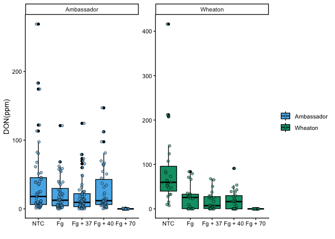
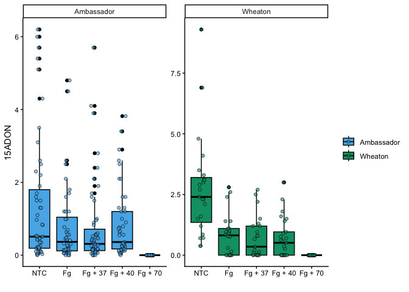
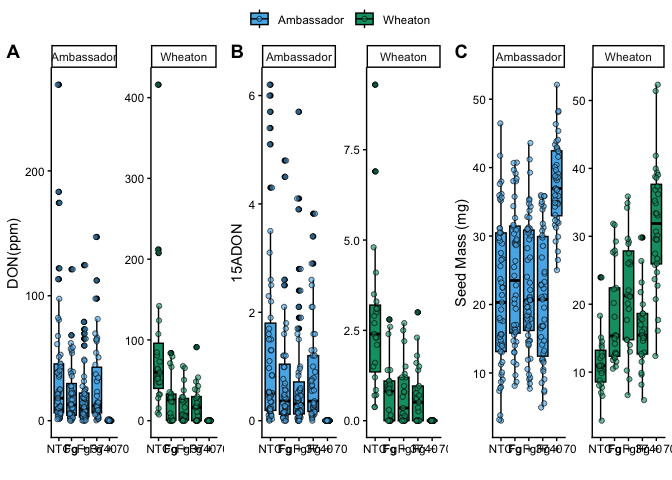

- [Question No 1](#question-no-1)
- [Question No 2](#question-no-2)
- [Question No 3](#question-no-3)
- [Question No 4](#question-no-4)
- [Question No 5](#question-no-5)
- [Question No 6](#question-no-6)

1.  At the top of the document, make a clickable link to the manuscript
    where these data are published. The link is here:

[Link to the data](https://doi.org/10.1094/PDIS-06-21-1253-RE)

# Question No 1

Explain the following

1.  YAML header

A YAML header is a metadata block at the top of a document that defines
settings like title, author, and output format. It controls how tools
like R Markdown render the document.

2.  Literate programming

Literate programming is a paradigm that integrates explanatory text and
executable code in one document. It improves clarity and reproducibility
by combining narrative, code, and results together.

# Question No 2

Take the code you wrote for coding challenge 3, question 5, and
incorporate it into your R markdown file. Some of you have already been
doing this, which is great! Your final R markdown file should have the
following elements.

2.  Read the data using a relative file path with na.strings option set
    to “na”. This means you need to put the Mycotoxin.csv file we have
    used for the past two weeks into your directory, which git tracks.

3.  Make a separate code chunk for the figures plotting the DON data,
    15ADON, and Seedmass, and one for the three combined using
    ggarrange.

``` r
library(ggplot2)
library(ggpubr)
cbbPalette <- c("#000000", "#E69F00", "#56B4E9", "#009E73", "#F0E442", "#0072B2", "#D55E00", "#CC79A7")
myco_data <- read.csv("MycotoxinData.csv", na.strings = "na")
myco_data$Treatment <- as.factor(myco_data$Treatment)
myco_data$Cultivar <- as.factor(myco_data$Cultivar)
str(myco_data)
```

    ## 'data.frame':    375 obs. of  6 variables:
    ##  $ Treatment     : Factor w/ 5 levels "Fg","Fg + 37",..: 1 1 1 1 1 1 1 1 1 1 ...
    ##  $ Cultivar      : Factor w/ 2 levels "Ambassador","Wheaton": 2 2 2 2 2 2 2 2 2 2 ...
    ##  $ BioRep        : int  2 2 2 2 2 2 2 2 2 3 ...
    ##  $ MassperSeed_mg: num  10.29 12.8 2.85 6.5 10.18 ...
    ##  $ DON           : num  107.3 32.6 416 211.9 124 ...
    ##  $ X15ADON       : num  3 0.85 3.5 3.1 4.8 3.3 6.9 2.9 2.1 0.71 ...

``` r
myco_data$Treatment <- factor(myco_data$Treatment, labels = c("NTC", "Fg","Fg + 37", "Fg + 40", "Fg + 70"))

plot2 <- ggplot(myco_data, aes(x = Treatment, y = DON, fill = Cultivar)) +
  geom_boxplot(position = position_dodge(), color = "black") +
  geom_point(position = position_jitterdodge(), alpha = 0.6, color = "black", pch = 21) +
  xlab("") +
  ylab("DON(ppm)") +
  facet_wrap(~Cultivar, scales = "free") + 
  scale_fill_manual(values = c(cbbPalette[[3]], cbbPalette[[4]]), name = "", labels = c("Ambassador", "Wheaton")) +
  theme_classic()

plot2
```

    ## Warning: Removed 8 rows containing non-finite outside the scale range
    ## (`stat_boxplot()`).

    ## Warning: Removed 8 rows containing missing values or values outside the scale range
    ## (`geom_point()`).

<!-- -->

``` r
plot3 <- ggplot(myco_data, aes(x = Treatment, y = X15ADON, fill = Cultivar)) +
  geom_boxplot(position = position_dodge(), color = "black") +
  geom_point(position = position_jitterdodge(), alpha = 0.6, color = "black", pch = 21) +
  xlab("") +
  ylab("15ADON") +
  facet_wrap(~Cultivar, scales = "free") + 
  scale_fill_manual(values = c(cbbPalette[[3]], cbbPalette[[4]]), name = "", labels = c("Ambassador", "Wheaton")) +
  theme_classic()

plot3
```

    ## Warning: Removed 10 rows containing non-finite outside the scale range
    ## (`stat_boxplot()`).

    ## Warning: Removed 10 rows containing missing values or values outside the scale range
    ## (`geom_point()`).

<!-- -->

``` r
plot4 <- ggplot(myco_data, aes(x = Treatment, y = MassperSeed_mg, fill = Cultivar)) +
  geom_boxplot(position = position_dodge(), color = "black") +
  geom_point(position = position_jitterdodge(), alpha = 0.6, color = "black", pch = 21) +
  xlab("") +
  ylab("Seed Mass (mg)") +
  facet_wrap(~Cultivar, scales = "free") + 
  scale_fill_manual(values = c(cbbPalette[[3]], cbbPalette[[4]]), name = "", labels = c("Ambassador", "Wheaton")) +
  theme_classic()

plot4
```

    ## Warning: Removed 2 rows containing non-finite outside the scale range
    ## (`stat_boxplot()`).

    ## Warning: Removed 2 rows containing missing values or values outside the scale range
    ## (`geom_point()`).

<!-- -->

``` r
Figure1 <- ggarrange(
  plot2,  # First plot
  plot3,  # Second plot
  plot4,  # Third plot
  labels = "AUTO",  # Automatically label the plots (A, B, C, etc.)
  nrow = 1,  # Arrange the plots in 3 rows
  ncol = 3,  # Arrange the plots in 1 column
  common.legend = TRUE  # Do not include a legend in the combined figure
)
```

    ## Warning: Removed 8 rows containing non-finite outside the scale range
    ## (`stat_boxplot()`).

    ## Warning: Removed 8 rows containing missing values or values outside the scale range
    ## (`geom_point()`).

    ## Warning: Removed 8 rows containing non-finite outside the scale range
    ## (`stat_boxplot()`).

    ## Warning: Removed 8 rows containing missing values or values outside the scale range
    ## (`geom_point()`).

    ## Warning: Removed 10 rows containing non-finite outside the scale range
    ## (`stat_boxplot()`).

    ## Warning: Removed 10 rows containing missing values or values outside the scale range
    ## (`geom_point()`).

    ## Warning: Removed 2 rows containing non-finite outside the scale range
    ## (`stat_boxplot()`).

    ## Warning: Removed 2 rows containing missing values or values outside the scale range
    ## (`geom_point()`).

``` r
Figure1
```

<!-- -->

# Question No 3

Knit your document together in the following formats:

1.  Choose one format: .docx (word document), .pdf, or .html. Make sure
    it includes a table of contents

2.  GitHub flavored markdown (.md file).

# Question No 4

Push the .docx or .pdf and .md files to GitHub inside a directory called
Coding Challenge 4.

# Question No 5

Now edit, commit, and push the README file for your repository and
include the following elements.

1.  A clickable link in your README to your GitHub flavored .md file

2.  A file tree of your GitHub repository.

# Question No 6

Please turn in the file generated in question 3a to canvas with a
clickable link to your GitHub repository within the document.
