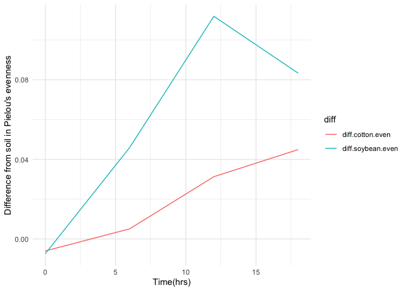

1.  3 pts. Download two .csv files from Canvas called DiversityData.csv
    and Metadata.csv, and read them into R using relative file paths.

``` r
library(tidyverse)
```

    ## ── Attaching core tidyverse packages ──────────────────────── tidyverse 2.0.0 ──
    ## ✔ dplyr     1.2.0     ✔ readr     2.2.0
    ## ✔ forcats   1.0.1     ✔ stringr   1.6.0
    ## ✔ ggplot2   4.0.2     ✔ tibble    3.3.1
    ## ✔ lubridate 1.9.5     ✔ tidyr     1.3.2
    ## ✔ purrr     1.2.1     
    ## ── Conflicts ────────────────────────────────────────── tidyverse_conflicts() ──
    ## ✖ dplyr::filter() masks stats::filter()
    ## ✖ dplyr::lag()    masks stats::lag()
    ## ℹ Use the conflicted package (<http://conflicted.r-lib.org/>) to force all conflicts to become errors

``` r
Diversitydata <- read.csv("DiversityData.csv")
head(Diversitydata)
```

    ##     Code  shannon invsimpson   simpson richness
    ## 1 S01_13 6.624921   210.7279 0.9952545     3319
    ## 2 S02_16 6.612413   206.8666 0.9951660     3079
    ## 3 S03_19 6.660853   213.0184 0.9953056     3935
    ## 4 S04_22 6.660671   204.6908 0.9951146     3922
    ## 5 S05_25 6.610965   200.2552 0.9950064     3196
    ## 6 S06_28 6.650812   199.3211 0.9949830     3481

``` r
Metadata <- read.csv("Metadata.csv")
head(Metadata)
```

    ##     Code Crop Time_Point Replicate Water_Imbibed
    ## 1 S01_13 Soil          0         1            na
    ## 2 S02_16 Soil          0         2            na
    ## 3 S03_19 Soil          0         3            na
    ## 4 S04_22 Soil          0         4            na
    ## 5 S05_25 Soil          0         5            na
    ## 6 S06_28 Soil          0         6            na

2.  4 pts. Join the two dataframes together by the common column ‘Code’.
    Name the resulting dataframe alpha.

``` r
alpha <- left_join(Diversitydata, Metadata, by = "Code")
str(alpha)
```

    ## 'data.frame':    70 obs. of  9 variables:
    ##  $ Code         : chr  "S01_13" "S02_16" "S03_19" "S04_22" ...
    ##  $ shannon      : num  6.62 6.61 6.66 6.66 6.61 ...
    ##  $ invsimpson   : num  211 207 213 205 200 ...
    ##  $ simpson      : num  0.995 0.995 0.995 0.995 0.995 ...
    ##  $ richness     : int  3319 3079 3935 3922 3196 3481 3250 3170 3657 3177 ...
    ##  $ Crop         : chr  "Soil" "Soil" "Soil" "Soil" ...
    ##  $ Time_Point   : int  0 0 0 0 0 0 6 6 6 6 ...
    ##  $ Replicate    : int  1 2 3 4 5 6 1 2 3 4 ...
    ##  $ Water_Imbibed: chr  "na" "na" "na" "na" ...

3.  4 pts. Calculate Pielou’s evenness index: Pielou’s evenness is an
    ecological parameter calculated by the Shannon diversity index
    (column Shannon) divided by the log of the richness column.

<!-- -->

1.  Using mutate, create a new column to calculate Pielou’s evenness
    index.
2.  Name the resulting dataframe alpha_even.

``` r
alpha2 <- mutate(alpha, logRich = log(richness))
str(alpha2)
```

    ## 'data.frame':    70 obs. of  10 variables:
    ##  $ Code         : chr  "S01_13" "S02_16" "S03_19" "S04_22" ...
    ##  $ shannon      : num  6.62 6.61 6.66 6.66 6.61 ...
    ##  $ invsimpson   : num  211 207 213 205 200 ...
    ##  $ simpson      : num  0.995 0.995 0.995 0.995 0.995 ...
    ##  $ richness     : int  3319 3079 3935 3922 3196 3481 3250 3170 3657 3177 ...
    ##  $ Crop         : chr  "Soil" "Soil" "Soil" "Soil" ...
    ##  $ Time_Point   : int  0 0 0 0 0 0 6 6 6 6 ...
    ##  $ Replicate    : int  1 2 3 4 5 6 1 2 3 4 ...
    ##  $ Water_Imbibed: chr  "na" "na" "na" "na" ...
    ##  $ logRich      : num  8.11 8.03 8.28 8.27 8.07 ...

``` r
alpha_even <- mutate(alpha2, evenness = shannon/logRich)
str(alpha_even)
```

    ## 'data.frame':    70 obs. of  11 variables:
    ##  $ Code         : chr  "S01_13" "S02_16" "S03_19" "S04_22" ...
    ##  $ shannon      : num  6.62 6.61 6.66 6.66 6.61 ...
    ##  $ invsimpson   : num  211 207 213 205 200 ...
    ##  $ simpson      : num  0.995 0.995 0.995 0.995 0.995 ...
    ##  $ richness     : int  3319 3079 3935 3922 3196 3481 3250 3170 3657 3177 ...
    ##  $ Crop         : chr  "Soil" "Soil" "Soil" "Soil" ...
    ##  $ Time_Point   : int  0 0 0 0 0 0 6 6 6 6 ...
    ##  $ Replicate    : int  1 2 3 4 5 6 1 2 3 4 ...
    ##  $ Water_Imbibed: chr  "na" "na" "na" "na" ...
    ##  $ logRich      : num  8.11 8.03 8.28 8.27 8.07 ...
    ##  $ evenness     : num  0.817 0.823 0.805 0.805 0.819 ...

4.  4.  Pts. Using tidyverse language of functions and the pipe, use the
        summarise function and tell me the mean and standard error
        evenness grouped by crop over time.

<!-- -->

1.  Start with the alpha_even dataframe
2.  Group the data: group the data by Crop and Time_Point.
3.  Summarize the data: Calculate the mean, count, standard deviation,
    and standard error for the even variable within each group.
4.  Name the resulting dataframe alpha_average

``` r
alpha_average <- alpha_even %>%
  group_by(Crop, Time_Point) %>% 
  summarise(Mean.evenness = mean(evenness), # calculating the mean richness, stdeviation, and standard error
            n = n(), 
            sd.dev = sd(evenness)) %>%
  mutate(std.err = sd.dev/sqrt(n))
```

    ## `summarise()` has regrouped the output.
    ## ℹ Summaries were computed grouped by Crop and Time_Point.
    ## ℹ Output is grouped by Crop.
    ## ℹ Use `summarise(.groups = "drop_last")` to silence this message.
    ## ℹ Use `summarise(.by = c(Crop, Time_Point))` for per-operation grouping
    ##   (`?dplyr::dplyr_by`) instead.

``` r
str(alpha_average)
```

    ## gropd_df [12 × 6] (S3: grouped_df/tbl_df/tbl/data.frame)
    ##  $ Crop         : chr [1:12] "Cotton" "Cotton" "Cotton" "Cotton" ...
    ##  $ Time_Point   : int [1:12] 0 6 12 18 0 6 12 18 0 6 ...
    ##  $ Mean.evenness: num [1:12] 0.82 0.805 0.767 0.755 0.814 ...
    ##  $ n            : int [1:12] 6 6 6 5 6 6 6 5 6 6 ...
    ##  $ sd.dev       : num [1:12] 0.00556 0.0092 0.01567 0.01689 0.00765 ...
    ##  $ std.err      : num [1:12] 0.00227 0.00376 0.0064 0.00755 0.00312 ...
    ##  - attr(*, "groups")= tibble [3 × 2] (S3: tbl_df/tbl/data.frame)
    ##   ..$ Crop : chr [1:3] "Cotton" "Soil" "Soybean"
    ##   ..$ .rows: list<int> [1:3] 
    ##   .. ..$ : int [1:4] 1 2 3 4
    ##   .. ..$ : int [1:4] 5 6 7 8
    ##   .. ..$ : int [1:4] 9 10 11 12
    ##   .. ..@ ptype: int(0) 
    ##   ..- attr(*, ".drop")= logi TRUE

5.  4.  Pts. Calculate the difference between the soybean column, the
        soil column, and the difference between the cotton column and
        the soil column

<!-- -->

1.  Start with the alpha_average dataframe
2.  Select relevant columns: select the columns Time_Point, Crop, and
    mean.even.
3.  Reshape the data: Use the pivot_wider function to transform the data
    from long to wide format, creating new columns for each Crop with
    values from mean.even.
4.  Calculate differences: Create new columns named diff.cotton.even and
    diff.soybean.even by calculating the difference between Soil and
    Cotton, and Soil and Soybean, respectively.
5.  Name the resulting dataframe alpha_average2

``` r
alpha_average2 <- alpha_average %>%
  select(Time_Point, Crop, Mean.evenness) %>% 
  pivot_wider(names_from = Crop, values_from = Mean.evenness) %>%
  mutate(diff.cotton.even = Soil - Cotton) %>%
  mutate(diff.soybean.even = Soil - Soybean)

head(alpha_average2)
```

    ## # A tibble: 4 × 6
    ##   Time_Point Cotton  Soil Soybean diff.cotton.even diff.soybean.even
    ##        <int>  <dbl> <dbl>   <dbl>            <dbl>             <dbl>
    ## 1          0  0.820 0.814   0.822         -0.00602          -0.00740
    ## 2          6  0.805 0.810   0.764          0.00507           0.0459 
    ## 3         12  0.767 0.798   0.687          0.0313            0.112  
    ## 4         18  0.755 0.800   0.716          0.0449            0.0833

6.  4 pts. Connecting it to plots

<!-- -->

1.  Start with the alpha_average2 dataframe
2.  Select relevant columns: select the columns Time_Point,
    diff.cotton.even, and diff.soybean.even.
3.  Reshape the data: Use the pivot_longer function to transform the
    data from wide to long format, creating a new column named diff that
    contains the values from diff.cotton.even and diff.soybean.even.
4.  This might be challenging, so I’ll give you a break. The code is
    below.

pivot_longer(c(diff.cotton.even, diff.soybean.even), names_to = “diff”)

4.  Create the plot: Use ggplot and geom_line() with ‘Time_Point’ on the
    x-axis, the column ‘values’ on the y-axis, and different colors for
    each ‘diff’ category. The column named ‘values’ come from the
    pivot_longer. The resulting plot should look like the one to the
    right.

``` r
alpha_average3 <- alpha_average2  %>%
  select(Time_Point, diff.cotton.even, diff.soybean.even) %>% 
  pivot_longer(c(diff.cotton.even, diff.soybean.even), names_to = "diff")
str(alpha_average3)
```

    ## tibble [8 × 3] (S3: tbl_df/tbl/data.frame)
    ##  $ Time_Point: int [1:8] 0 0 6 6 12 12 18 18
    ##  $ diff      : chr [1:8] "diff.cotton.even" "diff.soybean.even" "diff.cotton.even" "diff.soybean.even" ...
    ##  $ value     : num [1:8] -0.00602 -0.0074 0.00507 0.04589 0.03129 ...

``` r
plot1 <- ggplot(alpha_average3, aes(x = Time_Point, y = value, color = diff)) + # Plot it 
  geom_line() +
  theme_minimal() +
  xlab("Time(hrs)") +
  ylab("Difference from soil in Pielou's evenness")

plot1
```

<!-- -->

7.  2 pts. Commit and push a gfm .md file to GitHub inside a directory
    called Coding Challenge 5. Provide me a link to your github written
    as a clickable link in your .pdf or .docx
