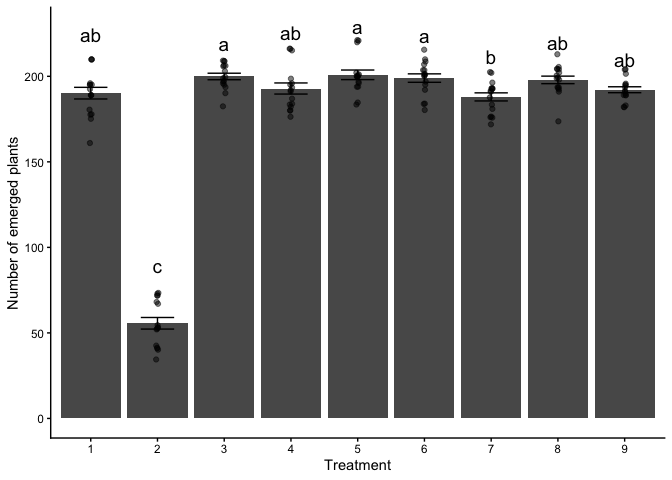

1.  4 pts. Read in the data called “PlantEmergence.csv” using a relative
    file path and load the following libraries. tidyverse, lme4,
    emmeans, multcomp, and multcompView. Turn the Treatment ,
    DaysAfterPlanting and Rep into factors using the function as.factor

``` r
datum1 <- read.csv("CodingChallenge7/PlantEmergence.csv", na.strings = "na")
str(datum1)
```

    ## 'data.frame':    144 obs. of  7 variables:
    ##  $ Plot             : int  101 102 103 104 105 106 107 108 109 201 ...
    ##  $ Treatment        : int  1 2 3 4 5 6 7 8 9 6 ...
    ##  $ Rep              : int  1 1 1 1 1 1 1 1 1 2 ...
    ##  $ Emergence        : num  180.5 54.5 195 198.5 202 ...
    ##  $ DatePlanted      : chr  "9-May-22" "9-May-22" "9-May-22" "9-May-22" ...
    ##  $ DateCounted      : chr  "16-May-22" "16-May-22" "16-May-22" "16-May-22" ...
    ##  $ DaysAfterPlanting: int  7 7 7 7 7 7 7 7 7 7 ...

``` r
library(tidyverse)
```

    ## ── Attaching core tidyverse packages ──────────────────────── tidyverse 2.0.0 ──
    ## ✔ dplyr     1.2.0     ✔ readr     2.2.0
    ## ✔ forcats   1.0.1     ✔ stringr   1.6.0
    ## ✔ ggplot2   4.0.2     ✔ tibble    3.3.1
    ## ✔ lubridate 1.9.5     ✔ tidyr     1.3.2
    ## ✔ purrr     1.2.1     
    ## ── Conflicts ────────────────────────────────────────── tidyverse_conflicts() ──
    ## ✖ dplyr::filter() masks stats::filter()
    ## ✖ dplyr::lag()    masks stats::lag()
    ## ℹ Use the conflicted package (<http://conflicted.r-lib.org/>) to force all conflicts to become errors

``` r
library(lme4)
```

    ## Loading required package: Matrix
    ## 
    ## Attaching package: 'Matrix'
    ## 
    ## The following objects are masked from 'package:tidyr':
    ## 
    ##     expand, pack, unpack

``` r
library(emmeans)
```

    ## Welcome to emmeans.
    ## Caution: You lose important information if you filter this package's results.
    ## See '? untidy'

``` r
library(multcomp)
```

    ## Loading required package: mvtnorm
    ## Loading required package: survival
    ## Loading required package: TH.data
    ## Loading required package: MASS
    ## 
    ## Attaching package: 'MASS'
    ## 
    ## The following object is masked from 'package:dplyr':
    ## 
    ##     select
    ## 
    ## 
    ## Attaching package: 'TH.data'
    ## 
    ## The following object is masked from 'package:MASS':
    ## 
    ##     geyser

``` r
library(multcompView)
```

``` r
datum1$Rep <- as.factor(datum1$Rep)
datum1$DaysAfterPlanting <- as.factor(datum1$DaysAfterPlanting)
datum1$Treatment <- as.factor(datum1$Treatment)
str(datum1)
```

    ## 'data.frame':    144 obs. of  7 variables:
    ##  $ Plot             : int  101 102 103 104 105 106 107 108 109 201 ...
    ##  $ Treatment        : Factor w/ 9 levels "1","2","3","4",..: 1 2 3 4 5 6 7 8 9 6 ...
    ##  $ Rep              : Factor w/ 4 levels "1","2","3","4": 1 1 1 1 1 1 1 1 1 2 ...
    ##  $ Emergence        : num  180.5 54.5 195 198.5 202 ...
    ##  $ DatePlanted      : chr  "9-May-22" "9-May-22" "9-May-22" "9-May-22" ...
    ##  $ DateCounted      : chr  "16-May-22" "16-May-22" "16-May-22" "16-May-22" ...
    ##  $ DaysAfterPlanting: Factor w/ 4 levels "7","14","21",..: 1 1 1 1 1 1 1 1 1 1 ...

2.  5 pts. Fit a linear model to predict Emergence using Treatment and
    DaysAfterPlanting along with the interaction. Provide the summary of
    the linear model and ANOVA results.

``` r
result1 <- lm(Emergence ~ Treatment + DaysAfterPlanting + Treatment:DaysAfterPlanting, data = datum1)
summary(result1)
```

    ## 
    ## Call:
    ## lm(formula = Emergence ~ Treatment + DaysAfterPlanting + Treatment:DaysAfterPlanting, 
    ##     data = datum1)
    ## 
    ## Residuals:
    ##     Min      1Q  Median      3Q     Max 
    ## -21.250  -6.062  -0.875   6.750  21.875 
    ## 
    ## Coefficients:
    ##                                  Estimate Std. Error t value Pr(>|t|)    
    ## (Intercept)                     1.823e+02  5.324e+00  34.229   <2e-16 ***
    ## Treatment2                     -1.365e+02  7.530e+00 -18.128   <2e-16 ***
    ## Treatment3                      1.112e+01  7.530e+00   1.477    0.142    
    ## Treatment4                      2.500e+00  7.530e+00   0.332    0.741    
    ## Treatment5                      8.750e+00  7.530e+00   1.162    0.248    
    ## Treatment6                      7.000e+00  7.530e+00   0.930    0.355    
    ## Treatment7                     -1.250e-01  7.530e+00  -0.017    0.987    
    ## Treatment8                      9.125e+00  7.530e+00   1.212    0.228    
    ## Treatment9                      2.375e+00  7.530e+00   0.315    0.753    
    ## DaysAfterPlanting14             1.000e+01  7.530e+00   1.328    0.187    
    ## DaysAfterPlanting21             1.062e+01  7.530e+00   1.411    0.161    
    ## DaysAfterPlanting28             1.100e+01  7.530e+00   1.461    0.147    
    ## Treatment2:DaysAfterPlanting14  1.625e+00  1.065e+01   0.153    0.879    
    ## Treatment3:DaysAfterPlanting14 -2.625e+00  1.065e+01  -0.247    0.806    
    ## Treatment4:DaysAfterPlanting14 -6.250e-01  1.065e+01  -0.059    0.953    
    ## Treatment5:DaysAfterPlanting14  2.500e+00  1.065e+01   0.235    0.815    
    ## Treatment6:DaysAfterPlanting14  1.000e+00  1.065e+01   0.094    0.925    
    ## Treatment7:DaysAfterPlanting14 -2.500e+00  1.065e+01  -0.235    0.815    
    ## Treatment8:DaysAfterPlanting14 -2.500e+00  1.065e+01  -0.235    0.815    
    ## Treatment9:DaysAfterPlanting14  6.250e-01  1.065e+01   0.059    0.953    
    ## Treatment2:DaysAfterPlanting21  3.500e+00  1.065e+01   0.329    0.743    
    ## Treatment3:DaysAfterPlanting21 -1.000e+00  1.065e+01  -0.094    0.925    
    ## Treatment4:DaysAfterPlanting21  1.500e+00  1.065e+01   0.141    0.888    
    ## Treatment5:DaysAfterPlanting21  2.875e+00  1.065e+01   0.270    0.788    
    ## Treatment6:DaysAfterPlanting21  4.125e+00  1.065e+01   0.387    0.699    
    ## Treatment7:DaysAfterPlanting21 -2.125e+00  1.065e+01  -0.200    0.842    
    ## Treatment8:DaysAfterPlanting21 -1.500e+00  1.065e+01  -0.141    0.888    
    ## Treatment9:DaysAfterPlanting21 -1.250e+00  1.065e+01  -0.117    0.907    
    ## Treatment2:DaysAfterPlanting28  2.750e+00  1.065e+01   0.258    0.797    
    ## Treatment3:DaysAfterPlanting28 -1.875e+00  1.065e+01  -0.176    0.861    
    ## Treatment4:DaysAfterPlanting28  2.997e-14  1.065e+01   0.000    1.000    
    ## Treatment5:DaysAfterPlanting28  2.500e+00  1.065e+01   0.235    0.815    
    ## Treatment6:DaysAfterPlanting28  2.125e+00  1.065e+01   0.200    0.842    
    ## Treatment7:DaysAfterPlanting28 -3.625e+00  1.065e+01  -0.340    0.734    
    ## Treatment8:DaysAfterPlanting28 -1.500e+00  1.065e+01  -0.141    0.888    
    ## Treatment9:DaysAfterPlanting28 -8.750e-01  1.065e+01  -0.082    0.935    
    ## ---
    ## Signif. codes:  0 '***' 0.001 '**' 0.01 '*' 0.05 '.' 0.1 ' ' 1
    ## 
    ## Residual standard error: 10.65 on 108 degrees of freedom
    ## Multiple R-squared:  0.9585, Adjusted R-squared:  0.945 
    ## F-statistic: 71.21 on 35 and 108 DF,  p-value: < 2.2e-16

``` r
anova(result1)
```

    ## Analysis of Variance Table
    ## 
    ## Response: Emergence
    ##                              Df Sum Sq Mean Sq  F value    Pr(>F)    
    ## Treatment                     8 279366   34921 307.9516 < 2.2e-16 ***
    ## DaysAfterPlanting             3   3116    1039   9.1603 1.877e-05 ***
    ## Treatment:DaysAfterPlanting  24    142       6   0.0522         1    
    ## Residuals                   108  12247     113                       
    ## ---
    ## Signif. codes:  0 '***' 0.001 '**' 0.01 '*' 0.05 '.' 0.1 ' ' 1

3.  5 pts. Based on the results of the linear model in question 2, do
    you need to fit the interaction term? Provide a simplified linear
    model without the interaction term but still testing both main
    effects. Provide the summary and ANOVA results. Then, interpret the
    intercept and the coefficient for Treatment 2.

No, we don’t need to fit the interaction term because the result is not
significant (pvalue is equal to 1) meaning we can leave out the
interaction term.

``` r
result2 <- lm(Emergence ~ Treatment + DaysAfterPlanting, data = datum1)
summary(result2)
```

    ## 
    ## Call:
    ## lm(formula = Emergence ~ Treatment + DaysAfterPlanting, data = datum1)
    ## 
    ## Residuals:
    ##      Min       1Q   Median       3Q      Max 
    ## -21.1632  -6.1536  -0.8542   6.1823  21.3958 
    ## 
    ## Coefficients:
    ##                     Estimate Std. Error t value Pr(>|t|)    
    ## (Intercept)          182.163      2.797  65.136  < 2e-16 ***
    ## Treatment2          -134.531      3.425 -39.277  < 2e-16 ***
    ## Treatment3             9.750      3.425   2.847  0.00513 ** 
    ## Treatment4             2.719      3.425   0.794  0.42876    
    ## Treatment5            10.719      3.425   3.129  0.00216 ** 
    ## Treatment6             8.812      3.425   2.573  0.01119 *  
    ## Treatment7            -2.188      3.425  -0.639  0.52416    
    ## Treatment8             7.750      3.425   2.263  0.02529 *  
    ## Treatment9             2.000      3.425   0.584  0.56028    
    ## DaysAfterPlanting14    9.722      2.283   4.258 3.89e-05 ***
    ## DaysAfterPlanting21   11.306      2.283   4.951 2.21e-06 ***
    ## DaysAfterPlanting28   10.944      2.283   4.793 4.36e-06 ***
    ## ---
    ## Signif. codes:  0 '***' 0.001 '**' 0.01 '*' 0.05 '.' 0.1 ' ' 1
    ## 
    ## Residual standard error: 9.688 on 132 degrees of freedom
    ## Multiple R-squared:  0.958,  Adjusted R-squared:  0.9545 
    ## F-statistic: 273.6 on 11 and 132 DF,  p-value: < 2.2e-16

``` r
anova(result2)
```

    ## Analysis of Variance Table
    ## 
    ## Response: Emergence
    ##                    Df Sum Sq Mean Sq F value    Pr(>F)    
    ## Treatment           8 279366   34921 372.070 < 2.2e-16 ***
    ## DaysAfterPlanting   3   3116    1039  11.068 1.575e-06 ***
    ## Residuals         132  12389      94                      
    ## ---
    ## Signif. codes:  0 '***' 0.001 '**' 0.01 '*' 0.05 '.' 0.1 ' ' 1

``` r
confint(result2)
```

    ##                           2.5 %      97.5 %
    ## (Intercept)          176.631133  187.695256
    ## Treatment2          -141.306614 -127.755886
    ## Treatment3             2.974636   16.525364
    ## Treatment4            -4.056614    9.494114
    ## Treatment5             3.943386   17.494114
    ## Treatment6             2.037136   15.587864
    ## Treatment7            -8.962864    4.587864
    ## Treatment8             0.974636   14.525364
    ## Treatment9            -4.775364    8.775364
    ## DaysAfterPlanting14    5.205313   14.239132
    ## DaysAfterPlanting21    6.788646   15.822465
    ## DaysAfterPlanting28    6.427535   15.461354

We found that Treatment 2 had 134.53 (+-6.775364;+-95% CI) less
emergence than Treatment 1 (pvalue\< 2e-16). The intercept is the
average emergence for treatment 1 7 days after planting which is
182.163. The coefficient of Treatment 2 is the difference in emergence
between treatment 2 and treatment 1.

4.  5 pts. Calculate the least square means for Treatment using the
    emmeans package and perform a Tukey separation with the compact
    letter display using the cld function. Interpret the results.

``` r
lsmeans <- emmeans(result2, ~Treatment) 
results_lsmeans <- cld(lsmeans, alpha = 0.05, details = TRUE) 
results_lsmeans
```

    ## $emmeans
    ##  Treatment emmean   SE  df lower.CL upper.CL .group
    ##  2           55.6 2.42 132     50.8     60.4  1    
    ##  7          188.0 2.42 132    183.2    192.8   2   
    ##  1          190.2 2.42 132    185.4    194.9   23  
    ##  9          192.2 2.42 132    187.4    196.9   23  
    ##  4          192.9 2.42 132    188.1    197.7   23  
    ##  8          197.9 2.42 132    193.1    202.7   23  
    ##  6          199.0 2.42 132    194.2    203.8    3  
    ##  3          199.9 2.42 132    195.1    204.7    3  
    ##  5          200.9 2.42 132    196.1    205.7    3  
    ## 
    ## Results are averaged over the levels of: DaysAfterPlanting 
    ## Confidence level used: 0.95 
    ## P value adjustment: tukey method for comparing a family of 9 estimates 
    ## significance level used: alpha = 0.05 
    ## NOTE: If two or more means share the same grouping symbol,
    ##       then we cannot show them to be different.
    ##       But we also did not show them to be the same. 
    ## 
    ## $comparisons
    ##  contrast                estimate   SE  df t.ratio p.value
    ##  Treatment7 - Treatment2  132.344 3.43 132  38.638 <0.0001
    ##  Treatment1 - Treatment2  134.531 3.43 132  39.277 <0.0001
    ##  Treatment1 - Treatment7    2.188 3.43 132   0.639  0.9993
    ##  Treatment9 - Treatment2  136.531 3.43 132  39.861 <0.0001
    ##  Treatment9 - Treatment7    4.188 3.43 132   1.223  0.9502
    ##  Treatment9 - Treatment1    2.000 3.43 132   0.584  0.9997
    ##  Treatment4 - Treatment2  137.250 3.43 132  40.071 <0.0001
    ##  Treatment4 - Treatment7    4.906 3.43 132   1.432  0.8832
    ##  Treatment4 - Treatment1    2.719 3.43 132   0.794  0.9969
    ##  Treatment4 - Treatment9    0.719 3.43 132   0.210  1.0000
    ##  Treatment8 - Treatment2  142.281 3.43 132  41.540 <0.0001
    ##  Treatment8 - Treatment7    9.938 3.43 132   2.901  0.0978
    ##  Treatment8 - Treatment1    7.750 3.43 132   2.263  0.3724
    ##  Treatment8 - Treatment9    5.750 3.43 132   1.679  0.7583
    ##  Treatment8 - Treatment4    5.031 3.43 132   1.469  0.8678
    ##  Treatment6 - Treatment2  143.344 3.43 132  41.850 <0.0001
    ##  Treatment6 - Treatment7   11.000 3.43 132   3.212  0.0425
    ##  Treatment6 - Treatment1    8.812 3.43 132   2.573  0.2083
    ##  Treatment6 - Treatment9    6.812 3.43 132   1.989  0.5538
    ##  Treatment6 - Treatment4    6.094 3.43 132   1.779  0.6957
    ##  Treatment6 - Treatment8    1.062 3.43 132   0.310  1.0000
    ##  Treatment3 - Treatment2  144.281 3.43 132  42.124 <0.0001
    ##  Treatment3 - Treatment7   11.938 3.43 132   3.485  0.0187
    ##  Treatment3 - Treatment1    9.750 3.43 132   2.847  0.1120
    ##  Treatment3 - Treatment9    7.750 3.43 132   2.263  0.3724
    ##  Treatment3 - Treatment4    7.031 3.43 132   2.053  0.5099
    ##  Treatment3 - Treatment8    2.000 3.43 132   0.584  0.9997
    ##  Treatment3 - Treatment6    0.938 3.43 132   0.274  1.0000
    ##  Treatment5 - Treatment2  145.250 3.43 132  42.406 <0.0001
    ##  Treatment5 - Treatment7   12.906 3.43 132   3.768  0.0074
    ##  Treatment5 - Treatment1   10.719 3.43 132   3.129  0.0535
    ##  Treatment5 - Treatment9    8.719 3.43 132   2.545  0.2204
    ##  Treatment5 - Treatment4    8.000 3.43 132   2.336  0.3288
    ##  Treatment5 - Treatment8    2.969 3.43 132   0.867  0.9943
    ##  Treatment5 - Treatment6    1.906 3.43 132   0.557  0.9998
    ##  Treatment5 - Treatment3    0.969 3.43 132   0.283  1.0000
    ## 
    ## Results are averaged over the levels of: DaysAfterPlanting 
    ## P value adjustment: tukey method for comparing a family of 9 estimates

Treatment 2 (mean = 55.6) had significantly lower emergence than all
others. Treatment 7 (mean = 188.0) had higher emergence than Treatment 2
but its emergence was statistically similar to Treatments 1, 9, 4, and
8. The highest emergence was in Treatments 5 which is statistically
similar wtih Treatment 6, 3, 8, 4, 9, and 1. While Treatments 6, 3, and
5 outperformed Treatment 7, there were no significant differences within
them (6,3and 5) or between them Treatment 1,4,8, and 9, suggesting most
treatments (except Treatment 2) perform similarly.

5.  4 pts. The provided function lets you dynamically add a linear model
    plus one factor from that model and plots a bar chart with letters
    denoting treatment differences. Use this model to generate the plot
    shown below. Explain the significance of the letters.

``` r
plot_cldbars_onefactor <- function(lm_model, factor) {
  data <- lm_model$model
  variables <- colnames(lm_model$model)
  dependent_var <- variables[1]
  independent_var <- variables[2:length(variables)]

  lsmeans <- emmeans(lm_model, as.formula(paste("~", factor))) # estimate lsmeans 
  Results_lsmeans <- cld(lsmeans, alpha = 0.05, reversed = TRUE, details = TRUE, Letters = letters) # contrast with Tukey adjustment by default.
  
  # Extracting the letters for the bars
  sig.diff.letters <- data.frame(Results_lsmeans$emmeans[,1], 
                                 str_trim(Results_lsmeans$emmeans[,7]))
  colnames(sig.diff.letters) <- c(factor, "Letters")
  
  # for plotting with letters from significance test
  ave_stand2 <- lm_model$model %>%
    group_by(!!sym(factor)) %>%
    dplyr::summarize(
      ave.emerge = mean(.data[[dependent_var]], na.rm = TRUE),
      se = sd(.data[[dependent_var]]) / sqrt(n())
    ) %>%
    left_join(sig.diff.letters, by = factor) %>%
    mutate(letter_position = ave.emerge + 10 * se)
  
  plot <- ggplot(data, aes(x = !! sym(factor), y = !! sym(dependent_var))) + 
    stat_summary(fun = mean, geom = "bar") +
    stat_summary(fun.data = mean_se, geom = "errorbar", width = 0.5) +
    ylab("Number of emerged plants") + 
    geom_jitter(width = 0.02, alpha = 0.5) +
    geom_text(data = ave_stand2, aes(label = Letters, y = letter_position), size = 5) +
    xlab(as.character(factor)) +
    theme_classic()
  
  return(plot)
}

plot_cldbars_onefactor(result2,"Treatment")
```

<!-- -->

The letters above each bar represent statistical groupings from a Tukey
HSD test (α = 0.05). Treatments sharing the same letter (e.g., “a”,
“ab”) are not significantly different in emergence. For example, Here,
the Treatment 2 is labeled “c” (lowest bar), and it is significantly
worse than all others. Treatment 7, the second lowest, (labelled “b”) is
statistically similar to treatments 1, 4, 8, and 9 that are labelled
with overlapping letters ( ab ). These treatment labels also overlap
with “a” indicating no significant differences with higher treatments (
3, 5, 6 labeled “a”).

6.  2 pts. Generate the gfm .md file along with a .html, .docx, or .pdf.
    Commit, and push the .md file to github and turn in the .html,
    .docx, or .pdf to Canvas. Provide me a link here to your github.

[Link to my github]()
